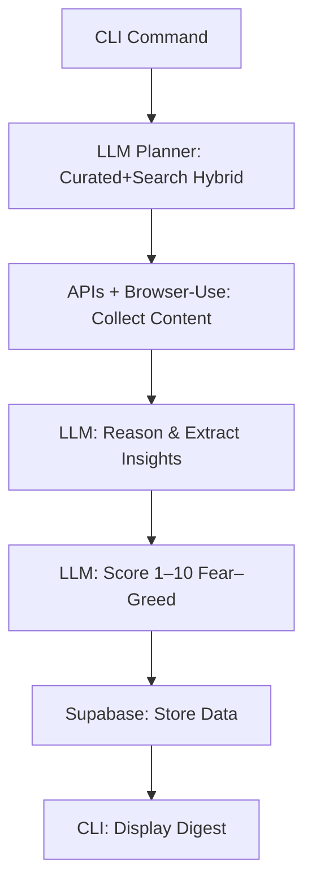

# AI-Powered Stock News & Sentiment Analysis System
**Version:** 2.0  
**Author:** Leo Gao  
**Date:** October 2025  
**Status:** Design Approved for Implementation  

---

## 1. Executive Summary

This system automates the end-to-end process of collecting, analyzing, and scoring stock-specific news and sentiment information.  
It combines a **dynamic curated + search hybrid** planner (LLM-guided), **Browser-Use** for precise web automation, and a **Large Language Model (LLM)** for reasoning and sentiment scoring.  

The solution is modular, scalable, and cost-efficient—ideal for research, portfolio monitoring, and investor analytics.

### Objectives
- Dynamically identify relevant, high-quality sources for a stock ticker (via the hybrid planner).  
- Collect and parse news/posts deterministically (via Browser-Use + APIs).  
- Extract sentiment and event metadata (via LLM Reasoning).  
- Generate a unified **Fear–Greed Score (1–10)**.  
- Store data in **Supabase** and provide terminal-based summaries.

---

## 2. System Architecture Overview

```
app/
 ├── domain/         # Core models & schema definitions
 ├── services/       # Planning, collection, reasoning, scoring
 ├── adapters/       # External integrations (LLM, Browser, Supabase, APIs)
 ├── pipelines/      # Orchestration and workflow composition
 ├── cli/            # Command-line entry points
 ├── infra/          # Config, logging, telemetry, error handling
 └── tests/          # Unit, contract, and integration tests
```

This modular structure isolates concerns for maintainability, testability, and horizontal scaling.

---

## 3. Functional Architecture

### 3.1 Source Planning (Dynamic Hybrid)

**Goal:**  
Leverage a **curated + search hybrid** planner, guided by an LLM, to dynamically prioritize news, filings, and social sources for a given ticker.

#### Input
```json
{
  "ticker": "TSLA",
  "window_hours": 6,
  "max_documents": 60,
  "include_social": true,
  "include_filings": true,
  "avoid_paywalls": true,
  "region_hint": "US",
  "lang": "en"
}
```

#### Planner Prompt Specification

**System Instruction:**
> You are a financial research planner. Return strict JSON describing search targets and curated sources. Obey document caps and stay within allowed domains.

**User Instruction:**
- Start from the approved curated source catalog (Reuters, Bloomberg, Tesla IR, SEC EDGAR, trusted Reddit subs, etc.).  
- Recommend additional queries for programmable search APIs (e.g., Alpha Vantage News, SerpAPI Google News, Bing News, Reddit) using timeframe and stopword filters.  
- Score each source by expected relevancy (0–1).  
- Respect `max_documents` and `max_runtime_minutes`.  
- Return JSON conforming to the schema below.

#### Output Schema Example
```json
{
  "version": "1.0",
  "ticker": "TSLA",
  "budget": {
    "max_runtime_minutes": 8,
    "max_documents": 60
  },
  "sources": {
    "filings": [
      {"kind": "sec", "query": "TSLA 8-K OR 10-Q"},
      {"kind": "ir", "url": "https://ir.tesla.com/press-releases"}
    ],
    "news": [
      {"kind": "wire", "url": "https://www.reuters.com/markets/companies/tesla"},
      {"kind": "business", "url": "https://www.bloomberg.com/companies/TSLA"}
    ],
    "social": [
      {"kind": "reddit", "query": "TSLA OR Tesla last:24h"},
      {"kind": "stocktwits", "symbol": "TSLA"}
    ],
    "official": [
      {"kind": "blog", "url": "https://www.tesla.com/blog"}
    ],
    "alternative": [
      {"kind": "rss", "url": "https://feeds.finance.yahoo.com/rss/2.0/headline?s=TSLA"}
    ]
  },
  "query_terms": [
    "Tesla earnings", "guidance", "delivery", "recall", "factory"
  ],
  "stop_conditions": {
    "no_new_docs_after_sources": 5,
    "hard_time_cap_minutes": 8
  }
}
```

#### Validation Rules
- Strict JSON schema validation.  
- Enforce ≤ 8-minute planning runtime and ≤ 60-document budget.  
- Require ≥2 credible news wires and ≥1 official/filing source.  
- Clamp planner output to the curated allowlist; fallback to defaults if invalid.

#### Integration in Pipeline
```python
from services.planner import plan_sources
from domain.schemas import PlannerPlan

async def plan_sources(payload: dict) -> PlannerPlan:
    plan_dict = await plan_sources(payload)
    return PlannerPlan.model_validate(plan_dict)
```

#### Collector Handoff
- Planner defines curated sources, search queries, and fallback policies.  
- Collector executes programmable API calls (Alpha Vantage, SerpAPI, RSS) and Browser-Use recipes using the planner’s instructions.  
- Ordering, time windows, and dedupe thresholds come from the plan.

---

### 3.2 Collection (APIs + Browser-Use)

**Goal:**  
Collect and normalize source data deterministically using **programmable APIs** (Alpha Vantage News, SerpAPI, Bing, Reddit) and **Browser-Use** fallbacks.

**Features:**
- Programmable API integrations for news/search feeds with rate limiting.  
- Browser-Use automation for full-text enrichment and long-tail sources.  
- Prefilter for English, recency ≤ window, text length ≥ 200 chars.  
- Deduplication via canonical hashing and canonical URL normalization.

**Output:**  
List of normalized articles (URL, title, date, text, source).

---

### 3.3 Reasoning (LLM)

**Goal:**  
Interpret articles and extract sentiment, stance, and event type.

**Example Output**
```json
{
  "about_ticker": 1,
  "sentiment": -0.4,
  "stance": "bearish",
  "event_type": "recall",
  "summary_1liner": "Tesla faces new safety recall for Model Y vehicles."
}
```

**Batching:**  
Up to 10 docs per call (max 1000 tokens each).

---

### 3.4 Sentiment Scoring (LLM)

**Goal:**  
Assign a **Fear–Greed score (1–10)** summarizing market emotion.

**Prompt Example:**
> Given sentiment, stance, and event type, output JSON `{score:int, rationale:str}` where 1=fear, 10=greed.

**Example Output**
```json
{
  "score": 8,
  "rationale": "Positive delivery results and strong forward guidance signal optimism."
}
```

**Aggregation (Optional):**  
`SessionScore = median(last N doc scores)`.

---

### 3.5 Persistence (Supabase)

| Table | Purpose | Key Columns |
|--------|----------|-------------|
| `articles` | Raw content | ticker, url, title, text, published_at, canonical_hash |
| `events` | Sentiment + classification | article_url, sentiment, stance, event_type |
| `scores` | Fear–Greed index | article_url, score, rationale |

**Constraints:**  
- `url UNIQUE`  
- `canonical_hash INDEX`  
- Upserts ensure idempotency.

---

### 3.6 Orchestration Pipeline

**Function:**
Runs the workflow from hybrid planning to sentiment scoring.

```python
async def run_once(ticker, window_h, max_docs):
    plan = await plan_sources({...})
    docs = await collect_articles(plan)
    results = await reason_batch(ticker, docs)
    for doc, ev in results:
        store_event(ev)
        score = await score_doc(ticker, {**doc, **ev})
        store_score(score)
```

**Characteristics**
- CLI-based runner  
- Async/await with deterministic caps  
- Retry on JSON errors  
- Safe token budgeting  

---

## 4. Data Model

| Entity | Key Fields | Description |
|--------|-------------|-------------|
| **Article** | ticker, url, title, text, published_at, canonical_hash | Raw scraped content |
| **Event** | about_ticker, sentiment, stance, event_type, summary | Processed reasoning output |
| **Score** | fear_greed, rationale | Sentiment index for investor mood |

---

## 5. Infrastructure

| Component | Role |
|------------|------|
| **Config** | Environment vars (API keys, runtime caps) |
| **Logging** | Structured JSON logs |
| **Telemetry** | Runtime + token metrics |
| **Security** | Key management & Supabase auth |
| **Ethics** | ToS and content compliance |

---

## 6. Execution Flow



---

## 7. Testing & Validation

| Test | Description |
|------|--------------|
| **Unit** | Validate domain logic, hashing, and filters |
| **Contract** | Validate planner JSON schema & search/API payloads |
| **Integration** | End-to-end with mock adapters |
| **Regression** | HTML selector consistency |
| **Behavioral** | Correlate FG score with market movement |

---

## 8. Operational Policies

| Policy | Setting |
|--------|----------|
| **Planner runtime** | ≤ 8 min, ≤ 60 docs |
| **Collector timeout** | 30s per page, 2 retries |
| **LLM batch size** | ≤ 10 docs |
| **Cache policy** | 2-hour planner reuse per ticker |
| **Fallback** | Use cached plan + RSS/API backup |

---

## 9. Scalability Roadmap

| Phase | Description |
|--------|-------------|
| **v1** | Terminal MVP (synchronous) |
| **v2** | Add queueing for async processing |
| **v3** | Supabase dashboard (Next.js) |
| **v4** | Multi-ticker orchestration |
| **v5** | Fine-tuned local LLM for reasoning |

---

## 10. Risks & Mitigations

| Risk | Mitigation |
|------|-------------|
| Invalid planner JSON | Strict schema + retry |
| Layout drift | Prefer RSS feeds |
| Token overrun | Chunk and truncate |
| LLM cost spikes | Reuse cached plan + small batches |
| Duplicates | Canonical hashing |
| Compliance | Respect robots.txt & paywall policies |

---

## 11. Conclusion

The integration of an **LLM-guided curated + search planner** establishes a powerful architecture for automated financial sentiment analysis.  
By delegating *planning* to the dynamic hybrid layer, *execution* to APIs + Browser-Use, and *reasoning* to the LLM, the system achieves a balance between intelligence, determinism, and scalability.

**Core Advantages:**
- Adaptive **source selection** using the LLM planner  
- Deterministic **collection** using Browser-Use  
- Structured **reasoning & scoring** using LLM  
- Transparent **data persistence** via Supabase  

The design is production-ready and suitable for both local deployment and scalable cloud execution.
